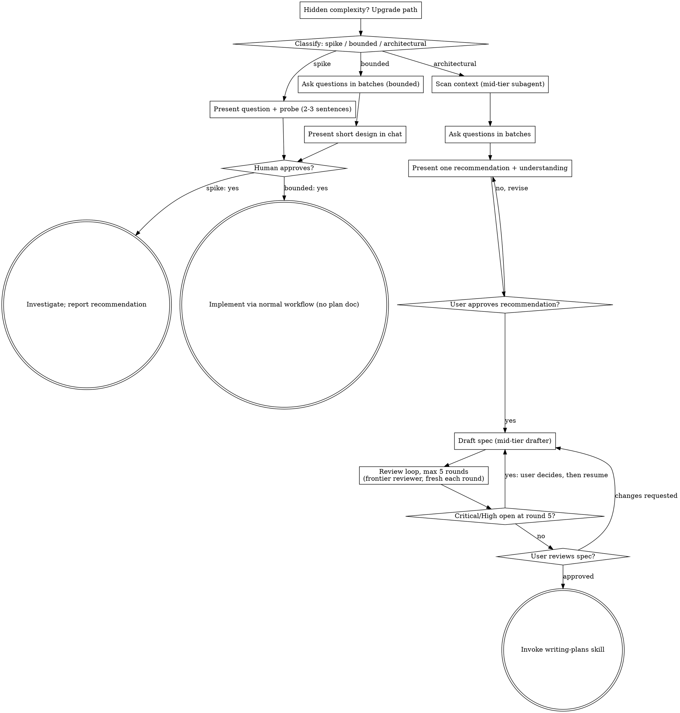

# Brainstorming Ideas Into Designs

Convert an idea into an approved design: gather context, ask questions
in batches, recommend one approach, and get your human partner's approval.

Start by classifying how much process the request needs, then work
through your path.

Vocabulary (workflow, phase, round, wave, task, step, batch) is fixed:
`../using-superpowers/references/terminology.md`. Use those words and no
others.

Model roles use two tiers, **frontier model** and **mid-tier model**
(`../using-superpowers/references/model-tiers.md`). Heavy lifting (code
scans, first drafts) goes to the mid-tier model. The frontier model is
reserved for structural reasoning and every review.

## Establish Shared Understanding

The outcome of brainstorming is an understanding your human partner can
recognize and correct, grounded in what they want to accomplish.

1. **Gather context first.** Read what the request and the repository
   already answer, so you ask only what they do not.
2. **Ask in batches.** After context, send a batch: one message holding
   every independent question. Keep the back-and-forth minimal, and leave
   no room for an assumption or confusion that could surface later. See
   "Question batches" below.
3. **Write back your understanding with your single recommendation.**
   Summarize the intended outcome, constraints, and success criteria,
   separating what they said from what they answered. Then state the one
   approach you recommend and why. Invite correction, and incorporate it
   before treating this as the design brief.
4. **Carry intent into the design.** Preserve the agreed understanding in
   the selected path's design artifact: the written spec for
   architectural work, or the in-chat design/probe for bounded work and
   spikes. Check proposed features and technical choices against it.

When the request already supplies the purpose and constraints, reflect
that understanding instead of asking the same questions again.

## Question batches

Minimize the back-and-forth by asking multiple independent questions in
each batch, but leave no room for assumptions or confusion that could
surface later.

- **One batch holds every independent question.** Never ask one question
  per message when the questions do not depend on each other.
- **A question that depends on an earlier answer waits for the next
  batch.** Nothing else waits. Send the next batch as soon as the answers
  arrive.
- **Every question carries your recommended default**, so your human
  partner can reply "defaults are fine" or override individual items.
- **Stop asking only when no assumption is left.** Before the write-back,
  list every assumption you would otherwise make. Each one becomes a
  question in the next batch, or an explicit line in the write-back that
  your human partner confirms.
- If the harness has a structured question tool that takes several
  questions per call, use it; otherwise a numbered list in one message.

The first batch covers, when the request does not already answer it:

- Purpose, who it is for, and what success looks like
- Constraints: versions, dependencies, deadlines, things not to touch
- **Backward compatibility** — only when the change affects something
  existing callers, data, or users depend on. Do not assume it is
  required; ask.
- **Commit policy** for execution: `auto` (commit at each task boundary)
  or `ask` (stop for approval before each commit). The spec and plan
  record the answer, and the execution skills obey it. This skill and
  writing-plans never run git themselves.
- **Final review** — once execution ends, the branch is reviewed through
  `/code-review`. Ask which **model** and which **effort** level to run it
  with. Record their exact words; do not pick for them and do not name a
  default. The spec and plan carry the answer, and the execution skills
  use it.
- Anything else the context scan showed is ambiguous or risky

<HARD-GATE>
Before taking any implementation action, including invoking an
implementation skill, writing product code, scaffolding, installing
product dependencies, or creating an external project, complete the
selected path's prerequisites:

- Spike: the human partner approves the question and probe.
- Bounded: the human partner approves the short in-chat design.
- Architectural: the human partner approves the recommendation, then
  reviews and approves the written spec, then reviews the written
  implementation plan and selects its execution method. Approval of the
  recommendation only permits drafting the spec; written-spec approval
  only permits invoking writing-plans.

A reply approves the phase actually presented. Approval of an idea or
feature scope does not approve artifacts that do not exist yet. Resume
at the earliest incomplete phase; do not turn one approval into permission
to skip the rest of the selected path. Read-only project exploration is
allowed while those prerequisites remain incomplete.
</HARD-GATE>

## Three Paths

Before your first question, classify the request and say the
classification out loud — "this looks bounded, so I'll present a short
design here rather than write a spec" — so your human partner can
override it:

- **Spike** — a feasibility question ("can we...", "is it possible...",
  "quick and dirty is fine") whose output is an answer, not code you
  keep. Present the question and what you'll try in 2-3 sentences, get
  a nod, then find out as cheaply as correctness allows. No design
  doc, no spec file. Report findings as a recommendation; anything you
  built stays labeled throwaway.
- **Bounded** — a well-scoped change to code that already exists in
  this repo: a new flag, a small endpoint, a one-file fix.
  Understanding the kind of app is not enough — bounded means the flow
  you are changing is already here to read. If there is no existing
  flow to change, the task is not bounded. Ask your questions in
  batches, present a short design IN CHAT (a few sentences to a few short
  paragraphs) with your single recommended approach, and STOP.
  Implementation starts only after your human partner says yes to that
  design — a bounded task's approval is as hard a gate as an
  architectural one. No spec file, no implementation plan document.
- **Architectural** — new projects, new subsystems, changes that
  restructure how components fit together or alter interfaces others
  depend on. Follow the full process: context scan, question batches,
  single recommendation, drafted spec, review loop, then writing-plans.

When in doubt between two paths, take the heavier one. The ratchet is
one-way: hidden complexity discovered mid-task upgrades the path —
stop, say so, and step up. Nothing downgrades mid-task.

## Anti-Pattern: "Too Simple To Need Approval"

Every path ends with your human partner approving the required design
before implementation. A bounded change may need only two sentences in
chat. A new todo-list project is architectural and requires the written
spec and planning handoffs. Scale the artifact to the selected path;
complete that path's reviews before implementation.

## Red Flags

| Thought | Reality |
|---------|---------|
| "This is too simple to need a design" | Follow the selected path: a bounded change gets a short chat design; an architectural change gets the written spec and planning handoffs. |
| "I'll call it bounded and skip the spec" | Reaching for a label to skip work IS the doubt — take the heavier path. |
| "It's bounded and the design is obvious — I'll start while they read it" | The gate is the approval, not the design's length. Present, then stop until you hear yes. |
| "I understand this kind of app, so it's bounded" | Bounded measures the repo, not your familiarity. A new project has no existing flow — it is architectural. |
| "The spike works, so I'll keep the code" | A spike's output is an answer. Keeping the code is a new request — classify it. |
| "It grew, but I'm almost done — no need to re-classify" | Hidden complexity upgrades the path mid-task. Stop and say so. |
| "They approved the spike, so the follow-up change is approved too" | Each task gets its own classification and its own approval. |
| "I'll ask the second question after they answer the first" | Independent questions go in the same batch, each with a default. Only a question that depends on an answer waits. |
| "I'll offer a couple of approaches so they can pick" | Pick the best one and recommend it. They can override it. |
| "I'll scan the code myself, it's faster" | Scans go to a mid-tier subagent. Your context is for decisions. |

## Checklist

Classify first, announce the path, then create a task for each item on
your path and complete them in order.

**Spike:**
1. **Explore project context** — enough to frame the probe
2. **Present question + probe plan** — 2-3 sentences
3. **Get approval** — a nod is enough
4. **Investigate** — as cheaply as correctness allows
5. **Report findings** — a recommendation; label anything built as throwaway

**Bounded:**
1. **Explore project context** — check files and docs
2. **Ask clarifying questions in batches** — every independent question per batch, defaults included
3. **Present short design in chat** — the single recommended approach, files touched, testing, commit policy
4. **Get approval** — STOP and wait for an explicit yes; presenting the design and starting in the same breath is skipping the gate
5. **Implement** — proceed with the normal development workflow (TDD applies); no plan document

**Architectural:**
1. **Set up the work directory** — `.superpowers/design/<stem>/`, where `<stem>` is `YYYY-MM-DD-<topic>`
2. **Scan context** — dispatch a mid-tier subagent (`./context-scanner-prompt.md`); it writes `context.md`
3. **Offer the visual companion just-in-time** — only if a question would genuinely be clearer shown than described. See the Visual Companion section below.
4. **Ask questions in batches** — see "Question batches"
5. **Present one recommendation + understanding** — produced on the frontier model; no alternatives listed. Get approval.
6. **Save the brief** — the approved understanding, recommendation, and every answer, to `<work-dir>/brief.md`
7. **Draft the spec** — mid-tier drafter (`./spec-drafter-prompt.md`) writes `docs/superpowers/specs/YYYY-MM-DD-<topic>-design.md`
8. **Run the review loop** — `./review-loop.md`, Spec phase, up to 5 rounds
9. **User reviews the written spec** — ask them to review the file before proceeding
10. **Hand off** — invoke writing-plans with only the spec path

## Process Flow

**Terminal states are path-bound.** Architectural: the ONLY skill you
invoke after brainstorming is writing-plans — never frontend-design,
mcp-builder, or any other implementation skill. Bounded: after
approval, implementation proceeds directly through the normal
development workflow; no plan document. Spike: the terminal state is a
reported recommendation.

## The Process

The subsections below serve the bounded and architectural paths (a
spike stops at "present the probe, get a nod"). Bounded work needs
context, question batches, and a short in-chat design. The rest is
architectural depth.

**Understanding the idea:**

- Check the project state first (files, docs). On the architectural path
  this is the context scan, done by a mid-tier subagent so its file reads
  stay out of your context. Read `context.md`, not the files.
- Before asking questions, assess scope: if the request describes multiple independent subsystems (e.g., "build a platform with chat, file storage, billing, and analytics"), flag this immediately. Don't refine a project that needs to be decomposed first.
- If the project is too large for a single spec, help the user decompose into sub-projects: what are the independent pieces, how do they relate, what order should they be built? Then brainstorm the first sub-project through the normal design flow. Each sub-project gets its own spec → plan → implementation cycle.
- Prefer multiple-choice questions with a default; open-ended is fine when there is no sensible default.
- Focus on understanding: purpose, constraints, success criteria.

**Recommending the approach:**

- Do the structural reasoning on the frontier model: yourself if you are
  one, otherwise dispatch a frontier-model subagent with `context.md` and
  the answers, and take back its recommendation.
- Present exactly one approach: what it is, why it fits this codebase,
  and what it deliberately leaves out. Do not list alternatives.
- YAGNI ruthlessly — remove unnecessary features from the design.

**Design for isolation and clarity:**

- Break the system into smaller units that each have one clear purpose, communicate through well-defined interfaces, and can be understood and tested independently
- For each unit, you should be able to answer: what does it do, how do you use it, and what does it depend on?
- Can someone understand what a unit does without reading its internals? Can you change the internals without breaking consumers? If not, the boundaries need work.
- Smaller, well-bounded units are also easier for you to work with - you reason better about code you can hold in context at once, and your edits are more reliable when files are focused. When a file grows large, that's often a signal that it's doing too much.

**Working in existing codebases:**

- Explore the current structure before proposing changes. Follow existing patterns.
- Where existing code has problems that affect the work (e.g., a file that's grown too large, unclear boundaries, tangled responsibilities), include targeted improvements as part of the design - the way a good developer improves code they're working in.
- Don't propose unrelated refactoring. Stay focused on what serves the current goal.

## After the Design (architectural path)

**Drafting and review:**

- Save the approved recommendation, understanding, and answers to
  `<work-dir>/brief.md`, then dispatch the spec drafter
  (`./spec-drafter-prompt.md`, mid-tier). It writes the spec to
  `docs/superpowers/specs/YYYY-MM-DD-<topic>-design.md`
  - (User preferences for spec location override this default)
- Run `./review-loop.md` for the Spec phase. The spec is finished, and
  approved by your human partner, before any plan is drafted.
- Do not run any git command on the spec: no commit, no staging.

**User Review Gate:**
When the loop exits clean, ask the user to review the written spec:

> "Spec written to `<path>` and review loop finished (`<open: line>`). Please review it and tell me what to change before we write the implementation plan. When everything is done, the final commit should include this spec and the plan — commit policy recorded as `<auto|ask>`; shall I keep that?"

Wait for the response. If they request changes, resume the drafter with
those changes and rerun the loop on the touched sections. Only proceed
once they approve.

**Handoff to planning:**

- Invoke the writing-plans skill and pass **only the spec path**. Do not
  summarize the conversation, the ledger, or your reasoning; the plan
  drafter starts with empty context and the approved spec is its whole
  input.
- Do NOT invoke any other skill. writing-plans is the next step.

## Visual Companion

A browser-based companion for showing mockups, diagrams, and visual options during brainstorming. Available as a tool — not a mode. Accepting the companion means it's available for questions that benefit from visual treatment; it does NOT mean every question goes through the browser.

**Offering the companion (just-in-time):** Do NOT offer it upfront. Wait until a question would genuinely be clearer shown than told — a real mockup / layout / diagram question, not merely a UI *topic*. The first time that happens, offer it then, as its own message:
> "This next part might be easier if I show you — I can put together mockups, diagrams, and comparisons in a browser tab as we go. It's still new and can be token-intensive. Want me to? I'll open it for you."

**This offer MUST be its own message.** Only the offer — no clarifying question, summary, or other content. Wait for the user's response. If they accept, start the server with `--open` so their browser opens to the first screen automatically. If they decline, continue text-only and don't offer again unless they raise it.

**Per-question decision:** Even after the user accepts, decide FOR EACH QUESTION whether to use the browser or the terminal. The test: **would the user understand this better by seeing it than reading it?**

- **Use the browser** for content that IS visual — mockups, wireframes, layout comparisons, architecture diagrams, side-by-side visual designs
- **Use the terminal** for content that is text — requirements questions, conceptual choices, tradeoff lists, A/B/C/D text options, scope decisions

A question about a UI topic is not automatically a visual question. "What does personality mean in this context?" is a conceptual question — use the terminal. "Which wizard layout works better?" is a visual question — use the browser.

If they agree to the companion, read the detailed guide before proceeding:
`skills/brainstorming/visual-companion.md`
